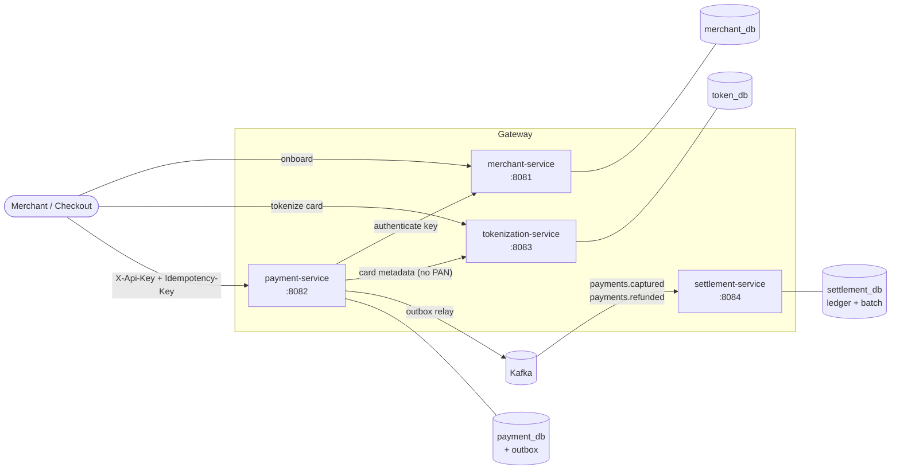
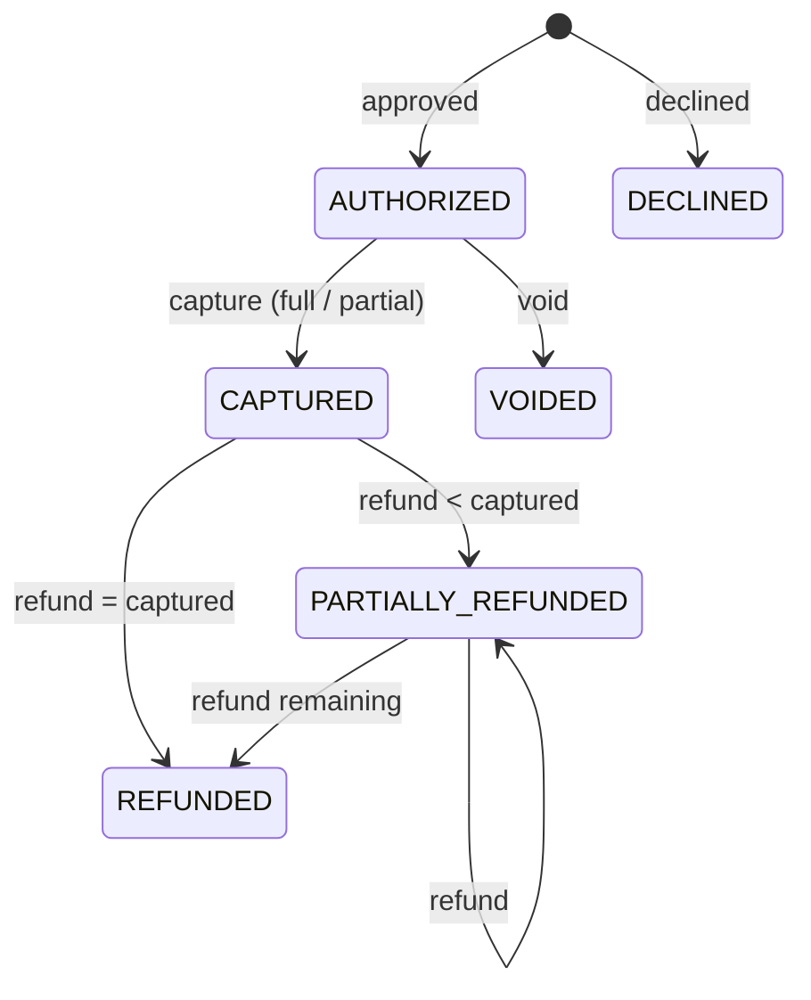

# Payment Gateway Sim


A small but realistic **card payment gateway** built as Spring Boot microservices. It covers the whole
money flow: merchant onboarding → card tokenization → authorization → capture / void / refund →
event streaming → ledger → daily settlement.

It's a simulator (there's no real card network), but it takes on the problems real payment systems
have to solve: **no double charges on retries, no lost events, no raw card numbers outside the vault,
and no ledger entry settled twice.**

---

## Architecture



| Service | Responsibility |
|---|---|
| **merchant-service** | Onboards merchants, issues API keys (stored as SHA-256 hashes only), authenticates keys for other services |
| **tokenization-service** | Card vault. Validates the PAN (Luhn + brand), encrypts it with AES-256-GCM, returns a `tok_…` token. No other service ever sees the card number |
| **payment-service** | Payment API: authorize, capture (full/partial), void, refund (full/partial). Idempotency keys, optimistic locking, transactional outbox → Kafka |
| **settlement-service** | Consumes payment events into a ledger (idempotent consumer + dead-letter topic) and runs a nightly **Spring Batch** job that settles each merchant |

## What this project demonstrates

| Problem | How it's solved | Where |
|---|---|---|
| Client retries a timed-out request and gets charged twice | **Idempotency keys**: `(merchant, key)` is unique. A replay with the same body returns the original payment; a different body gets a 422. Concurrent duplicates are settled by the DB unique constraint | `PaymentService.create`, `idempotency_keys` table |
| DB commit succeeds but the Kafka publish fails (or the reverse) | **Transactional outbox**: the event row is written in the same transaction as the payment. A poller relays it using `FOR UPDATE SKIP LOCKED`, so multiple instances can run safely | `outbox/OutboxWriter`, `outbox/OutboxRelay` |
| Kafka delivers the same event twice | **Idempotent consumer**: the ledger PK is the event id, `INSERT … ON CONFLICT DO NOTHING` | `LedgerRepository.record` |
| A malformed message blocks the partition | `DefaultErrorHandler`: 3 retries, then **dead-letter topic** (`<topic>.DLT`) | `KafkaErrorHandlingConfig` |
| Two captures/refunds race on the same payment | JPA `@Version` **optimistic locking** → 409 | `Payment` |
| Invalid state changes (refund before capture, over-refund, double capture) | Rich domain model: all transitions go through the `Payment` aggregate | `Payment`, `PaymentTest` |
| PCI scope | Card numbers live only in the vault, encrypted (AES-GCM, random IV) with an HMAC fingerprint for "same card" detection. The request DTO even masks the PAN in `toString()` | `tokenization-service` |
| Settling the same day twice | Spring Batch job instance keyed on `settlementDate`. Ledger rows are stamped with the settlement id in the same chunk transaction | `SettlementJobConfig`, `SettlementWriter` |
| Money rounding bugs | Amounts are `long` minor units everywhere; fees use `BigDecimal` with explicit `HALF_UP` | `FeeCalculator` |
| Hanging on a slow downstream | Connect/read timeouts on every `RestClient`; errors map to 503 | `ClientConfig` |

Errors follow **RFC 9457 Problem Details** (`application/problem+json`) in every service.

## Tech stack

Java 21 · Spring Boot 3.5 · Spring Web MVC · Spring Data JPA · Spring JDBC (`JdbcClient`) · Spring Kafka ·
Spring Batch · PostgreSQL 17 · Flyway · Apache Kafka (KRaft, no ZooKeeper) · springdoc OpenAPI ·
JUnit 5 · Mockito · AssertJ · Docker Compose · GitHub Actions

## Running it

### Option A: everything in Docker

```bash
docker compose up --build
```

### Option B: infrastructure in Docker, services from IntelliJ (best for debugging)

```bash
docker compose up postgres kafka
```

Then run the four `*Application` classes from IntelliJ (or `mvn -pl payment-service spring-boot:run`, etc.).
The defaults in each `application.yml` point at `localhost`.

### Swagger UI

| Service | URL |
|---|---|
| merchant | http://localhost:8081/swagger-ui.html |
| payment | http://localhost:8082/swagger-ui.html |
| tokenization | http://localhost:8083/swagger-ui.html |
| settlement | http://localhost:8084/swagger-ui.html |

## Demo walkthrough

The quickest way is to open [`http/demo.http`](http/demo.http) in IntelliJ and run the requests from top to bottom.
It captures the API key, token and payment id automatically.

Or with curl:

```bash
# 1. Onboard a merchant: save the apiKey, it's only shown once
curl -s -X POST localhost:8081/api/v1/merchants -H 'Content-Type: application/json' \
  -d '{"name":"Kedai Kopi","email":"owner@kedaikopi.example","feeBps":250}'

# 2. Tokenize a test card
curl -s -X POST localhost:8083/api/v1/tokens -H 'Content-Type: application/json' \
  -d '{"pan":"4242424242424242","expiryMonth":12,"expiryYear":2030}'

# 3. Authorize + capture RM 150.00 (amounts are in sen)
curl -s -X POST localhost:8082/api/v1/payments \
  -H 'Content-Type: application/json' -H "X-Api-Key: $API_KEY" -H 'Idempotency-Key: order-1001' \
  -d "{\"amount\":15000,\"currency\":\"MYR\",\"cardToken\":\"$TOKEN\",\"capture\":true}"

# 4. Run the same command again → same payment id, header "Idempotent-Replayed: true"

# 5. Refund RM 20.00
curl -s -X POST localhost:8082/api/v1/payments/$PAYMENT_ID/refunds \
  -H 'Content-Type: application/json' -H "X-Api-Key: $API_KEY" -d '{"amount":2000}'

# 6. Check the ledger, then settle today
curl -s "localhost:8084/api/v1/ledger?merchantId=$MERCHANT_ID"
curl -s -X POST "localhost:8084/api/v1/settlements/run?date=$(date -u +%F)"
curl -s "localhost:8084/api/v1/settlements?merchantId=$MERCHANT_ID"
```

### Test cards

| Card number | Result |
|---|---|
| `4242 4242 4242 4242` | Visa, approved |
| `5555 5555 5555 4444` | Mastercard, approved |
| `3782 822463 10005` | Amex, approved |
| `4000 0000 0000 0002` | Declined: `card_declined` |
| `4000 0000 0000 9995` | Declined: `insufficient_funds` |
| any card, amount > 5,000,000 | Declined: `amount_limit_exceeded` |

## Payment lifecycle



## API summary

| Method | Path | Service |
|---|---|---|
| `POST` | `/api/v1/merchants` | merchant |
| `GET` | `/api/v1/merchants/{id}` | merchant |
| `PATCH` | `/api/v1/merchants/{id}/status` | merchant |
| `POST` | `/api/v1/merchants/{id}/api-key/rotate` | merchant |
| `POST` | `/api/v1/tokens` | tokenization |
| `POST` | `/api/v1/payments` (needs `Idempotency-Key`) | payment |
| `GET` | `/api/v1/payments`, `/api/v1/payments/{id}` | payment |
| `POST` | `/api/v1/payments/{id}/capture` | payment |
| `POST` | `/api/v1/payments/{id}/void` | payment |
| `POST` / `GET` | `/api/v1/payments/{id}/refunds` | payment |
| `GET` | `/api/v1/ledger?merchantId=` | settlement |
| `POST` | `/api/v1/settlements/run?date=` | settlement |
| `GET` | `/api/v1/settlements?merchantId=` | settlement |

All payment endpoints require `X-Api-Key`, and payments are always scoped to the calling merchant.

## Project structure

```
payment-gateway-sim/
├── common/                  # shared event contract (PaymentEvent) and topic names
├── merchant-service/
├── tokenization-service/
├── payment-service/
├── settlement-service/
├── http/demo.http           # runnable end-to-end demo (IntelliJ HTTP Client)
├── infra/postgres/init.sql  # one database per service
├── docker-compose.yml
└── Dockerfile               # one multi-stage build, parameterised by MODULE
```

## Tests

```bash
mvn verify
```

Unit tests cover the payment state machine, idempotent replay/conflict, the issuer simulator,
Luhn/brand detection, AES-GCM round-trip and tamper detection, fee rounding and settlement maths.

## Roadmap

- [ ] Testcontainers integration tests (Postgres + Kafka) for the outbox → ledger flow
- [ ] Spring Cloud Gateway in front, with rate limiting per API key
- [ ] Idempotency keys on capture/refund as well
- [ ] Webhooks to merchants (signed with HMAC) on payment status changes
- [ ] Observability: Micrometer tracing across services + Grafana dashboard
- [ ] Kubernetes manifests / Helm chart

## Disclaimer

This is a learning project. It isn't PCI DSS compliant and must never handle real card data.
Encryption keys in `application.yml` are for local development only.
